```{r setup, include=FALSE}
knitr::opts_chunk$set(echo = TRUE)
library(knitr)
library(kableExtra)
```

\newpage
# Introduction

Stack Overflow is a website part of Stack Exchange network where people ask and answer questions about different topics where Stack Overflow is about programming. As of today, June 2021, there has been over 21 Million questions asked^[https://stackoverflow.com/company]. Over 92% of Stack Overflow questions about expert topics are answered in a median time of 11 minutes, Using a mixed methods approach [@mamykina2011design]. One way to answer a question in short time is to use tags so for example the system can easily identify a question asked about python using it's tags and show it in the feed of an expert with a relative experience.

Each question have 3 parts, Title, Body and up to 5 tags, which should be relevant to the question being asked. The aim of this paper is to look at the title and the body and to try predict the tags using machine learning. This problem has been first asked by Facebook through a competition on Kaggle using a large data set, about 3GB and over 6 Million questions^[https://www.kaggle.com/c/facebook-recruiting-iii-keyword-extraction/overview]. However, in this paper a smaller data set is used.

This problem is a supervised learning problem where classification should be used. In Statistics and Machine Learning, Classification is the problem of identifying which of a set of categories (sub-populations) an observation, (or observations) belongs to [@unknown-author-2021]. Common forms of classification are Binary Classification and Multi-class Classification, which both involve predicting non overlapping classes. However, in some cases observations could have overlapping classes or labels, which is what this problem is about.


# Theory

## Multi-Label Classifiers

  Broadly, there are two categories of classification methods: Single-label Classification methods (SLC) and Multi-label Classification (MLC) methods. Binary and Multi-class Classifications are two sub-categories of single-label classification.

In MLC each data sample is associated with several labels/tags simultaneously. Therefore, MLC algorithms have to be able to output several labels, instead of single one as opposed to Single-label Classification methods.

Therefore, with Y being the total set of labels in a Multi-label Dataset $D$ and $x_i$ a sample in $D$, a multi-label classifier $C$ must produce as output a set $Z_i \subseteq Y$ with the predicted labels for the i-th sample. As each distinct label in $Y$ could appear in $Z_i$. Each one of these combinations is called a labelset. The same labelset can appear in several instances of $D$


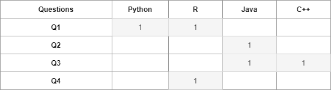{width=60%}

There are two main approaches [@Tsoumakas2010] to accomplish MLC task:

* **Data Transformation**:

This method aims to transform a multi-label dataset into a dataset or group of datasets that can be processed with traditional classifiers. Transformation methods can be branched into four categories [@irjet]:

* Binary Methods: Like Binary Relevance (BR) and Classifier Chains (CC).
* Label Combinations Methods: Like Label Power-set (LP) and Pruned Set (PS).
* Pair-wise Methods: Like Ranking via Pair-wise Comparison (RPC) and Calibrated Label Ranking (CLR).
* Ensemble Methods: Like Random k-label sets (RAkEL) and Multi-Label k Nearest Neighbors(ML-KNN).


* **Algorithm Adaptation**: 

In this method, an SLC algorithm is modified then applied to a multi-label data. There are several algorithms exist like: Multi-Label Decision-Tree (ML-DT), Multi-Label k Nearest Neighbors(ML-KNN), Support Vector Machine with Heterogeneous Feature Kernel (SVM-HF), Ranking Support Vector Machine (Rank-SVM) and Multi-label Tree based Boosting methods.

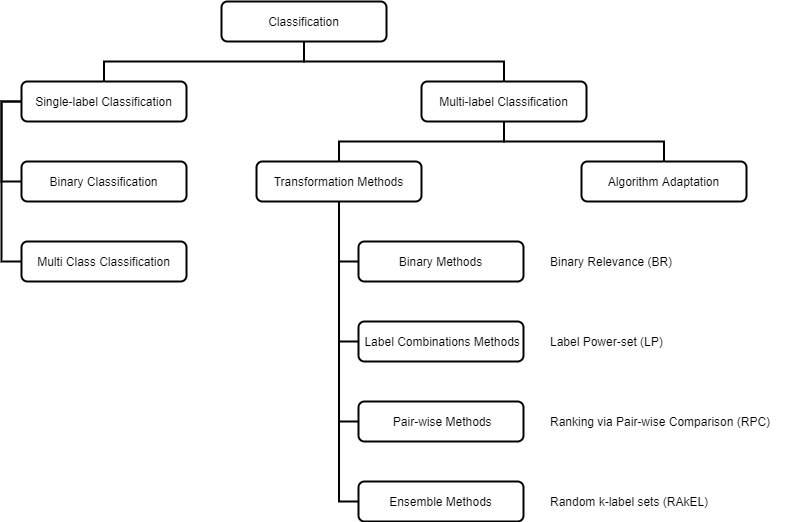{width=70%}

In this paper Binary Relevance and Classifier Chains will be used to classify the Stack Overflow data due to their simplicity and low computational complexity, which depends on the number of distinct label-sets that exists in the training set and the complexity of the base SLC classifier being used.


<!-- To measure the degree of multi-labeledness of a dataset, Label Cardinality, Card is used: -->

<!-- Where: -->

<!-- $$Card(D) = \sum_{i=1}^{|D|} \frac{Y_i}{|D|}$$ -->


### Binary Relevance

The Binary Relevance method decomposes an MLC problem into several distinct single-label binary classification problems, one for each of the q labels in the set $Y = \{y_1, y_2, ..., y_q\}$. The BR transforms the original multi-label training dataset into q binary datasets $D_{y_j} \; (1≤ j ≤ q)$, where each $D_{y_j}$ contains all the instances of original dataset, and trains a q binary classifiers $c_j$ one for each dataset. If particular instance contains label $y_j$, then it is labeled positively otherwise labeled negatively.

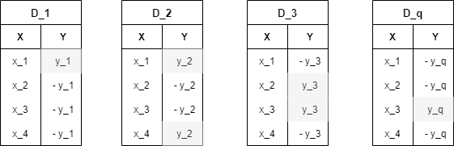{width=60%}

For unseen instance $x^*$, BR outputs the aggregation of the labels positively predicted by all the independent binary classifiers.

\begin{algorithm}[H]
\DontPrintSemicolon
\SetAlgoLined
\SetKwInOut{Input}{Input}\SetKwInOut{Output}{Output}
\Input{BinaryRelevance(D, C)}
\BlankLine
\For{j=1 to q}{
    Construct the binary training set $D_j = {(x^i, y^i_j) | 1 ≤ i ≤ m}$
    $(x^i \in X, y^i \in \{−1, +1\}^q, X = \mathbb{R}^d, Y = \{y_1, y_2, . . . , y_q\})$\;
    $c_j ← C(D_j )$\;
}
\Return $Y^*= {y_j|c_j(x^*)>0, 1 ≤ j ≤ q}$

\caption{Binary Relevance}
\end{algorithm} 

The advantage of the BR approach is its low computational complexity compared to the other multi-label methods. For a constant number of examples, BR scales linearly with size q of the label set Y. Giving the complexity of the base-classifiers is bound to O(C), the complexity of BR is $q \times O(C)$.

However, the BR method has a strong limitation regarding the use of label relationship information. As stated before, BR fails to consider label dependency, as it makes the strong assumption of label independency [@CLEIej]. 

### Classifier Chains

This approach involves chaining together binary classifiers in a directed structure, such that individual label predictions become features for other classifiers.

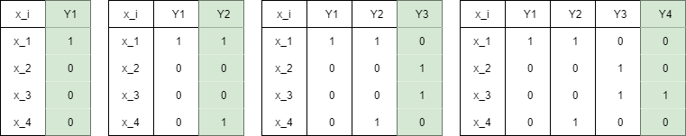{width=80%}

The Classifier Chains model (CC) involves *q* binary classifiers as in BR. Classifiers are linked along a chain where each classifier deals with the binary relevance problem associated with label $y_j \in Y$. The feature space of each link in the chain is extended with the 0/1 label associations of all previous links. 

This chaining method passes label information between classifiers, allowing CC to take into account label correlations and thus overcoming the label independence problem of BR [@Waikato].

\begin{algorithm}[H]
\DontPrintSemicolon
\SetAlgoLined
\SetKwInOut{Input}{Input}\SetKwInOut{Output}{Output}
\Input{ClassifierChains(D, C)}
\BlankLine
\For{j=1 to q}{
    $D^\prime \leftarrow \{\}$ \newline
    \For{$(x,Z) \in D \; | \; Z \; \subseteq Y $}{
        $D^\prime = D^\prime \; \cup \; ((x, y_1, ...,y_{j-1}), y_j)$ \;
        $c_j: D^\prime \rightarrow y_j \in \{0, 1\}$\;
    }
}
\BlankLine
$\hat{Z} = \{\}$ \;
\For{j=1 to q}{
  $\hat{Z} \; = \;  \hat{Z} \; \cup \; y_j \leftarrow c_j: (x,y_1, ...,y_{j-1})$
}
\Return $(x,\hat{Z})$
\caption{Classifier Chains}
\end{algorithm} 


## Single-Label Classifiers

### Multinomial Naive Bayes (MNB)

A probabilistic learning method, where the probability of a document $d$ being in class $c$ is computed as

$$p(y|d)  \propto P(y) \prod_{1 \leq k \leq n_d} P(t_k|y)$$
Where $P(t_k|y)$ is the conditional probability of term $t_k$ occurring in a document of class $y$. $P(t_k|y)$ is a measure of how much evidence $t_k$ contributes that $y$ is the correct class. $P(y)$ is the prior probability of a document occurring in class $y$. If a document's terms do not provide clear evidence for one class versus another, we choose the one that has a higher prior probability. $t_1, t_2, ..., t_{n_d}$ are the tokens in $d$ that are part of the vocabulary used for classification and $n_d$ is the number of such tokens in $d$ [@manning2008introduction].

In text classification, the goal is to find the best class for the document. The best class in NB classification is the most likely or maximum a posteriori $y_{map}$:

$$y_{map} = argmax_{y \in Y} \hat{P}(y|d) = argmax_{y \in Y} \hat{P}(y) \prod_{1 \leq k \leq n_d} \hat{P}(t_k|y)$$
Where $\hat{P}$ is the estimated $P$ from the training set. 

The prior $\hat{P}(y)$ is the relative frequency and corresponds to the most likely value of each parameter given in the training set.

$$\hat{P}(y) = \frac{N_y}{N}$$
Where $N_y$ is the number of documents in class $y$ and $N$ is the total number of documents.

And the conditional probability $\hat{P}(t|y)$ as the relative frequency of term $t$ in documents belonging to class $y$:

$$\hat{P}(t|y) = \frac{T_{yt}}{\sum_{t` \in V} T`_{yt`}}$$
Where $T_{yt}$ is the number of occurrences of $t$ in training documents from class $y$, including multiple occurrences of a term in a document[@manning2008introduction].

One feature of the Naive Bayes Classifier is that it assumes conditional independence between the tokens $t_1, t_2, ..., t_{n_d}$ given the selected class $y$:

$$\hat{P}(t_k|t_1, t_2, ..., t_{n_d},y) = \hat{P}(t_k|y), \;\;\; 1 \leq k \leq n_d$$


### Logistic Regression (LR)

To learn a text classifier, $y = c(x)$, from a set of training examples $D = \{(x_1, y_1), ...,(x_i, y_i), ...,(x_n, y_n)\}$. For text classification, the vectors $x_i = [t_1, t_2 , ..., t_{n_d}]^T$ comprise transformed word frequencies (tf-idf's) from documents. The values $y_i ∈ \{−1, +1\}$ are class labels encoding membership (+1) or nonmembership (−1) of the vector in
the category.

Logistic regression is a conditional probability model of the form:

$$\hat{P}(y_i = +1|\beta, x_i) = \frac{1}{1 + exp(−β^T x_i)}$$

For a text classification problem, $\hat{P}(y = +1|x_i)$ corresponds to the probability that the $i$th document belongs to the class $y$. The decision of whether to assign the class can be based on comparing the probability estimate with a threshold or, more generally, based on maximizing the expected effectiveness.

Maximum likelihood estimation of the parameters $\beta$ is equivalent to minimizing the negative log-likelihood:

$$l(\beta) = -\sum^n_{i=1}ln(1 + exp(−β^T x_iy_i)$$
Correspondingly, finding the ridge logistic regression parameters is done by minimizing:

$$l_{ridge}(\beta) = l(\beta) + \lambda \sum^{n_d}_{k=1} β^2_k$$
whereas lasso logistic regression requires minimization of:

$$l_{lasso}(\beta) = l(\beta) + \lambda \sum^{n_d}_{k=1} |\beta_k|$$
where λ is a hyperparameter controlling degree of regularization.


### Linear Support Vector Classification (LSVC)

SVM searches for a separating hyperplane,, which separates positive class membership examples {+1} and negative nonmembership examples {-1} from each other with maximal margin, in other words, maximize the distance of the decision surface between the two classes.

 A decision hyperplane can be defined by an intercept term $b$ and a decision hyperplane normal vector $w$ which is perpendicular to the hyperplane, also known as the weight vector. To choose among all the hyperplanes that are perpendicular to the normal vector, we specify the intercept term $b$. Because the hyperplane is perpendicular to the normal vector, all points $x$ on the hyperplane satisfy $w^Tx = -b$. Given a set of training data points $D = \{(x_i,y_i) \}$, where each member is a pair of a point $x_i$ and a class label $y_i$ corresponding to it[@manning2008introduction]. The linear classifier is then:
 
 The equation of a hyperplane is:

$$f(x) = x^Tw+b = 0$$
Where $w$ is a unit vector: $||w||= 1$. A classification rule induced by f(x) is:
$$G(x) = sign(x^Tw+b)$$
The optimization problem of SVM is to minimize over ($w,b$) where the value of $1/2 \; \cdot \; w^Tw$ subject to:
$$\forall_i^n: y_i[x^Tw+b] \geq 1$$
The optimal $w$ hyperplane has the minimum expected error of classification on an
unseen and randomly selected example. SVM can be generalized to handle non-separable cases in two way. First, with

$$1/2 \; \cdot \; w^Tw + C \cdot \sum_{i=1}^n \xi_i$$

Where C is a constant to trade off between margin and training error.

And minimize over (w,b) the value of:

$$\forall_i^n: y_i[x^Tw+b] \geq 1 - \xi_i$$

Where the weights $w_i$ should satisfy the following constraints:

$$\forall i: 0 \leq w \leq C \;\; and \;\; \sum_{i=1}^n w_i y_i = 0$$


## Evaluation Methods

Evaluation methods that are usually used in SLC classify each instance into two possible states: correct or incorrect. However, in MLC tasks, an instance can be classified as partially correct. Therefore, MLC problems require different evaluation metrics than
the ones traditionally used in SLC, and can be categorized in two types [@Tsoumakas2010]: 

i) Example-based measures
ii) Label-based measures

Below are a selection of evaluation metrics used in this work.

### Example-based measures:

Evaluates the performance based on the average differences of the actual and the predicted sets of labels over all examples of a given evaluation data set.

- *Subset Accuracy*

Also called Exact Match Rate, provides the proportion of label sets that are predicted correctly. A disadvantage of this metrics is that unless the predicted label set is completely correct the it will not be considered which make this measurement harsh.


$$Subset\;Accuracy = \frac{1}{|D|} \sum_{i=1}^{|D|} I(Z_i = \hat{Z_i})$$
Where $Z_i$ is the actual set of labels for the $i$th classified instance, and $\hat{Z_i}$ is the predicted set.

- *Jaccard Similarity*

Examines the proportion of correctly predicted positive labels out of the potential positive set (predicted positive and actually positive).

$$Jaccard\;Similarity = \frac{1}{|D|} \sum_{i=1}^{|D|} \frac{|Z_i \cap \hat{Z_i}|}{|Z_i \cup \hat{Z_i}|}$$

- *Hamming Loss*

Hamming Loss measures the number of times a label is incorrectly predicted. Ideally, a hamming loss, HL = 0, which would imply no error; practically the smaller the value of hamming loss, the better the performance of the learning algorithm.
$$Hamming\;Loss = \frac{1}{|D|} \sum_{i=1}^{|D|} \frac{1}{|Y|} \sum_{j=1}^{|Y|} I(y_j \neq \hat{y_j})$$

- *Precision*

Precision is the proportion of predicted correct labels to the total number of actual labels, averaged over all instances.
$$Precision = \frac{1}{|D|} \sum_{i=1}^{|D|} \frac{Z_i \cap \hat{Z_i}}{\hat{Z_i}}$$

- *Recall*

Recall is the proportion of predicted correct labels to the total number of predicted labels, averaged over all instances.
$$Recall = \frac{1}{|D|} \sum_{i=1}^{|D|} \frac{Z_i \cap \hat{Z_i}}{{Z_i}}$$

- *F1 Score*

The F1 score can be interpreted as a weighted average of the precision and recall.
$$F1\;Score = \frac{1}{|D|} \sum_{i=1}^{|D|} \;2\;\cdot\; \frac{|Z_i \cap \hat{Z_i}|}{|Z_i| + |\hat{Z_i}|}$$

### Label-based measures: 

Decompose the evaluation process into separate evaluations for each label and does not take into account the relations between the labels. Each label is evaluated first then averaged over all labels, it can be further categorized into Micro, Macro and Weighted Averaged Measures.


<!-- these measures are based on the average differences of the true set $S$ and the predicted set of labels $\hat{S}$, and are called example-based measures[@CLEI].  -->


- *Micro Averaged Measures*

Micro-averaging first calculates the sum of all true positives and false positives, over all the classes, then computes the precision for the sums. 

By definition, micro-averaged measures would be more affected by the performance of the classes which has more examples, so if the goal is to maximize the number of hits and minimize the misses it would be better suited than macro-averaging, like in this case where the aim is predict the more fitting tags to each question given the data is imbalanced.

$$Precision_{micro} = \frac{\sum_{j=1}^{|Y|} TP_j}{\sum_{j=1}^{|Y|} TP_j + FP_j}$$
$$Recall_{micro} = \frac{\sum_{j=1}^{|Y|} TP_j}{\sum_{j=1}^{|Y|} TP_j + FN_j}$$
$$F1\;Score_{micro} = 2 \; \cdot \; \frac{Precision_{micro} \;\cdot\; Recall_{micro}}{Precision_{micro} \;+\; Recall_{micro}}$$

- *Macro Averaged Measures*

In macro-averaging, the measure is first calculated per label, then averaged over the number of labels. Macro averaging thus gives equal weight to each label, regardless of how often the label appears. 

By definition, macro-averaged measures would be more affected by the performance of the classes which has fewer examples, which is not desired in the case of Stack Overflow questions and the effects will be even more exaggerated with imbalanced classes like our data set.

$$Precision_{macro} = \frac{1}{|Y|}\sum_{j=1}^{|Y|} \frac{ TP_j}{ TP_j + FP_j}$$
$$Recall_{macro} = \frac{1}{|Y|}\sum_{j=1}^{|Y|} \frac{ TP_j}{ TP_j + FN_j}$$

$$F1\;Score_{macro} = 2 \; \cdot \; \frac{Precision_{macro} \;\cdot\; Recall_{macro}}{Precision_{macro} \;+\; Recall_{macro}}$$

- *Weighted Average Measures*

Weighted-average works similar to macro-average but it accounts for class imbalance by weighting the class score by its ratio in the true data sample.
$$Precision_{weighted} = \frac{1}{|L|}\sum_{j=1}^{|Y|} \; |y_j|\;\cdot\;\frac{ TP_j}{ TP_j + FP_j}$$


$$Recall_{weighted} = \frac{1}{|L|}\sum_{j=1}^{|Y|}\; |y_j|\;\cdot\; \frac{ TP_j}{ TP_j + FN_j}$$

$$F1\;Score_{weighted} = 2 \; \cdot \; \frac{Precision_{weighted} \;\cdot\; Recall_{weighted}}{Precision_{weighted} \;+\; Recall_{weighted}}$$
Where $L$ is all the total of labels in the dataset, compared to $Y$ which is the total number unique labels in the data set.

&nbsp;
&nbsp;

# Data

The dataset used in this project is available on Kaggle^[https://www.kaggle.com/imoore/60k-stack-overflow-questions-with-quality-rate]. It consists of 60,000 Stack Overflow questions from 2016-2020 and 6 columns:

- **Id**: *Index*
- **Title**: *The title of the question in string format.*
- **Body**: *The body of the question in HTML format.*
- **Tags**: *Labels chosen by the questioner to concisely describe the question.* 
- **Creation Date**: *Date in UTC format.*
- **Y**: *Indicator of the question quality.*

In this study, only 3 columns will be used: Title, Body and Tags (Figure 5). It is important to note that each question can only have at least one tag and up to five tags.

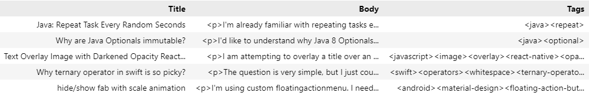{width=100%}

&nbsp;

## Data Pre-Processing

Each column processed separately as follows:

- Title: Tokenized directly using spaCy's en_core_web_lg^[https://spacy.io/models/en#en_core_web_lg] and then stop words removed.

- Body: First the text is striped from the HTML snippets using BeautifulSoup^[https://www.crummy.com/software/BeautifulSoup/bs4/doc/#] and tokenized using spaCy's en_core_web_lg and then stop words removed from the whole body including the code. 

- Body Text: Takes only the text part of the body without including the code snippets and it have the stop words removed.

- Body Code: Takes only the code part of the body without including the rest of the text and the stop words are kept since some code expressions have many stop words.

- Tags: Question tags are split and put in a list.

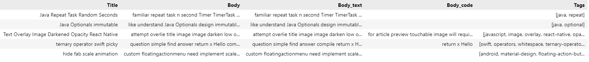{width=100%}

## Exploratory Data Analysis

Summary statistics are shown in (Figure 7). We can notice that there are extremely lengthy titles and bodies, and there are titles and bodies with 0 words as well. However, no action taken to trim lengthy questions nor to exclude any outliers.

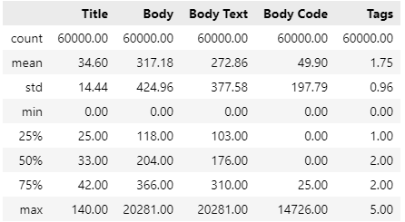{width=40%}

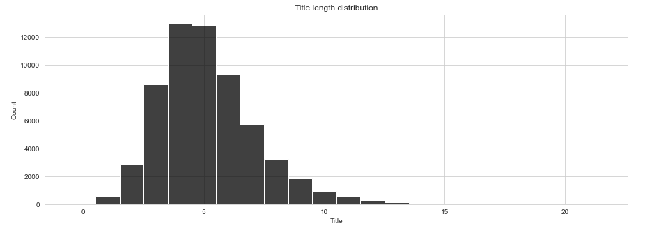{width=80%}

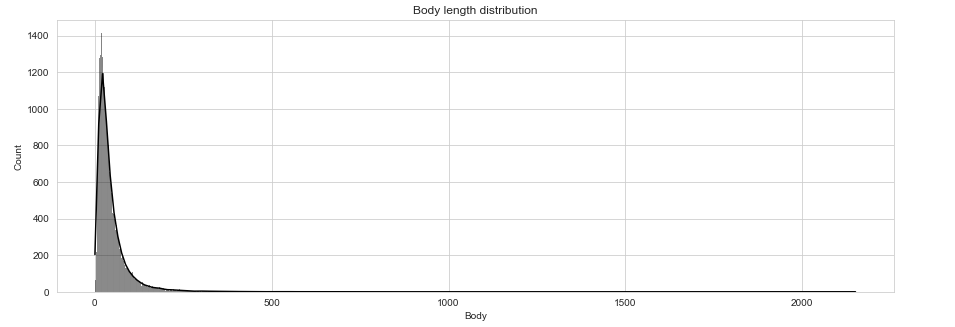{width=80%}

In the title apart from stop words there is no big differences between word frequencies, the frequencies go smoothly from the most frequent word to the least frequent as shown in (Figure 10).

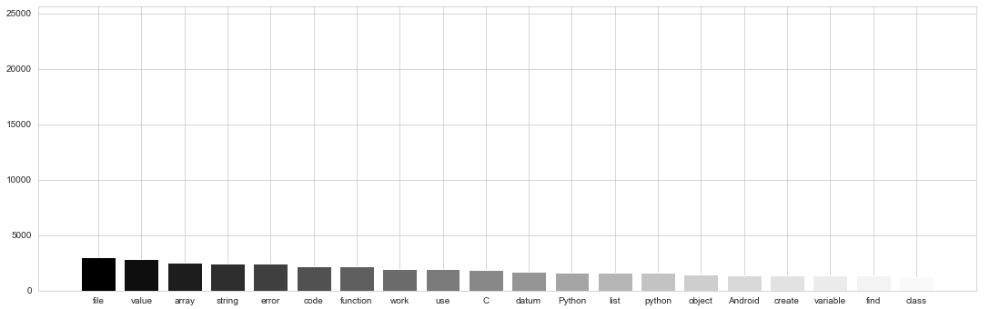{width=80%}

<!-- {width=60%} -->

In the body text (not including the code) it also follows the same smooth pattern i.e. no dominant words with huge margins, the only excepting here is the word counts is much higher since the body contain more word counts than the title (Figure 11).

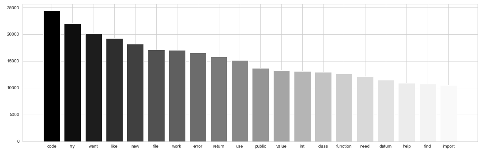{width=80%}


<!-- {width=60%} -->
<!-- It is worth mentioning that body code is tokenized differently than body text for EDA purposes only, so stop words are not removed from code since many stop words are used in many programming languages syntaxes, Figure 12 shows the most common code expressions used the most. -->

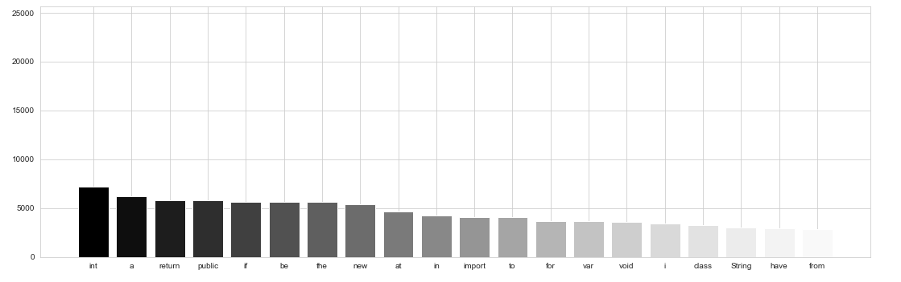{width=80%}

<!-- {width=60%} -->

When it comes to tag frequency, there is a huge class imbalance between tags (Figure 13). There is no Downsampling or Oversampling used, instead the number of labels is truncated to 200 label (Figure 14) and rely on flexible evaluation metrics. 


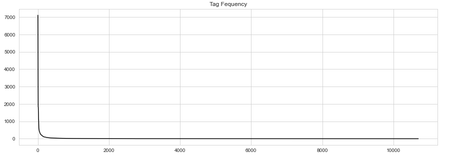{width=80%}

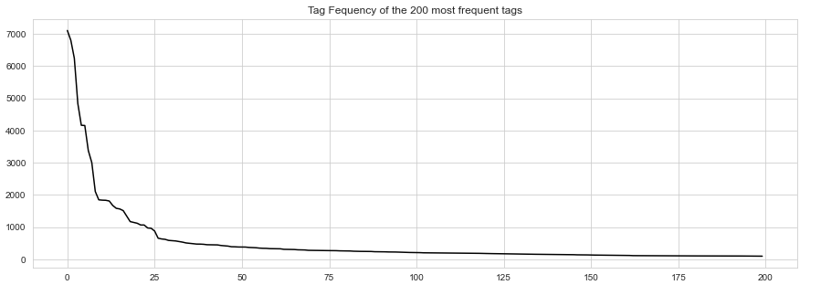{width=80%}

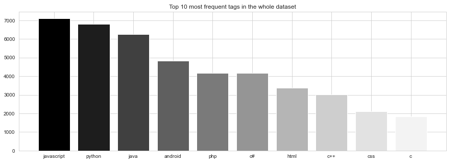{width=80%}

<!-- 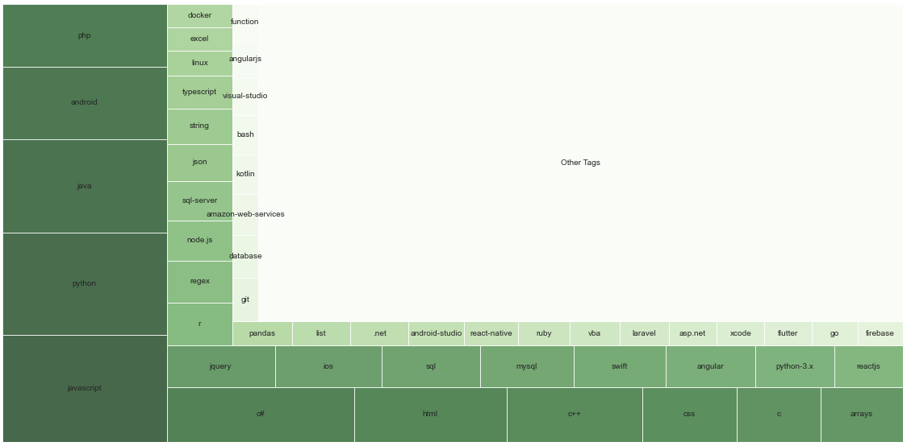{width=80%} -->


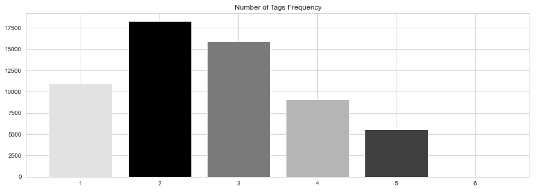{width=80%}


<!-- {width=60%} -->

\newpage
# Method

After selecting the 200 most common labels and removing all other labels, the tags are converted into a label binary indicator array where each sample have a vector of binary values (zeros and ones) where the one, i.e. the non zero elements, corresponds to the subset of labels for that sample^[https://scikit-learn.org/stable/modules/preprocessing_targets.html#preprocessing-targets].

The data is then split into training dataset with 80% of the data (48,000 rows) and testing dataset with 20% (12,000 rows).

## Feature Selection

Two sets of features is used:

- First set is the Title and the Body(including both text and code) which has been tokenized as one piece of text (removing stop words from the code as well).

- The second set set is the Title and Body Text and Body Code as separate features, in this case the code is tokenized differently allowing for stop words to exist.

TF-IDF is then applied as simple word embedding method to convey the information to the classifier. Term Frequency-Inverse Document Frequency(TF-IDF) is a numerical statistic that is intended to reflect how important a word is to a document in a collection or corpus [@rajaraman_ullman_2011].


$$tf-idf(t,d) = tf(t,d) \;\cdot\; log \frac{N}{df(t)}$$
Where $N$ denotes the number of documents in the collection, $tf$ is the term frequency and $df$ is the document frequency.

Using Scikit-Learn's TfidfVectorizer^[https://scikit-learn.org/stable/modules/generated/sklearn.feature_extraction.text.TfidfVectorizer.html] some of the parameters are set to the following:

  - max_df = 0.8 
This will ignore any terms that are too frequent and appear in 80% or more in all titles or question bodies.

  - min_df = 0.0001
This will ignore any terms that are not frequent and appear in 0.01% or less in all titles or question bodies.

  - max_features = 10,000
This will only consider the top 10,000 features ordered by term frequency across the corpus.

  - ngram_range = (1,3)
This will consider unigrams, bigrams and trigrams when making the tf-idf vector for each sample feature. 

&nbsp;

## Classification

Three types of SLC classifiers have been used with each of the MLC classifiers that have been selected, Binary Relevance and Classifier Chains. 

For Logistic Regression and Linear SVC, SGDClassifier, a function in Scikit-Leaen, is used to classify using Logistic Regression when loss = "log" and Linear SVC when loss = "hinge".

The SGDClassifier implements regularized linear models with Stochastic Gradient Descent (SGD) as a solver, in this experiment we set the learning rate to 0.0001, maximum iteration = 10,000, and used early stopping for which this function set aside a stratified fraction of training data as validation and terminate training when validation score returned by the score method is not improving^[https://scikit-learn.org/stable/modules/generated/sklearn.linear_model.SGDClassifier.html].

The data is passed to the SlC and treated as if only 2 classes exists, the classifier will classify each sample whether it belongs to the label or not. The MLC will then aggregate the results after running the SLC over all the labels in the case of Binary Relevance or chain the results in the Classifier Chains case.


# Results

<!-- There are four sets of results generated in this experiment: -->

<!-- - Binary Relevance with Title and Body as features -->
<!-- - Classifier Chains with Title and Body as features -->
<!-- - Binary Relevance with Title, Body Text and Body Code as features -->
<!-- - Classifier Chains with Title, Body Text and Body Code as features -->

```{r echo=FALSE}
options(digits=2)

df1 <- read.csv('Results/BinaryRelvance_2f.csv')
df1[,2] <- c('MNB', 'LR', 'LSVC')
df2 <- read.csv('Results/ClassifierChain_2f.csv')
df2[,2] <- c('MNB', 'LR', 'LSVC')
df3 <- read.csv('Results/BinaryRelvance_3f.csv')
df3[,2] <- c('MNB', 'LR', 'LSVC')
df4 <- read.csv('Results/ClassifierChain_3f.csv')
df4[,2] <- c('MNB', 'LR', 'LSVC')

df <- rbind(df1, df2, df3, df4)[-1]

names(df) <- c("Model", "Time", "HL", "Acc", "Jacc",
             "Prec", "Rec", "F1",
             "Prec", "Rec", "F1",
             "Prec", "Rec", "F1",
             "Prec", "Rec", "F1")

kbl(df, longtable = T, booktabs = T, caption = "Results") %>%
  add_header_above(c(" " = 2, "Sample Based" = 6, "Micro" = 3, "Macro" = 3, "Weighted" = 3)) %>%
  kable_styling(latex_options = c("striped", "hold_position", "repeat_header"), font_size = 6, position = "center") %>%
  pack_rows("Binary Relevance/Features: Title, Body", 1, 3) %>%
  pack_rows("Classifier Chains/Features: Title, Body", 4, 6) %>%
  pack_rows("Binary Relevance/Features: Title, Body Text, Body Code", 7, 9) %>%
  pack_rows("Classifier Chains/Features: Title, Body Text, Body Code", 10, 12)

# 
```

From (Table 1) It can be noticed that MNB is much faster than LR and LSVR, Binary Relevance is about 1.3 to 4 times faster than Classifier Chains, and 2 Features setting is better than 3 Features.

Due to rounding, Hamming Loss seems to be constant at 0.01 for all classifiers across all experiments, (Table 2) shows there is slight differences between the classifiers, in particular LR seems better (with smaller HL) than MNB and LSVC, BR better than CC, and 2 Features better than 3 Features.

```{r echo=FALSE}
kbl(rbind(df[[1]], df[[3]]), booktabs = T, caption = "Hamming Loss") %>%
  add_header_above(c("BR/2F" = 3, "CC/2F" = 3, "BR/3F" = 3, "CC/3F" = 3)) %>%
  kable_styling(latex_options = c("HOLD_position"), font_size = 7, position = "center") 
```

The only noticeable difference in Subset Accuracy (Exact Match Rate) is the difference between MNB and the other two classifiers, which they have better accuracies. This difference between MNB and the rest will continue over the other metrics as well.

LSVC seems to perform better across all metrics except for Precision, which LR is better. The same applies to using 2 features over 3 features, and to CC over BR except in this case BR is better in Precision metrics.

Below is an example of predicted tags against actual tags using MNB with BR and two features (Title and Body).

Actual Tags of the first 10 rows in the testing dataset:
`[('javascript', 'json'), ('javascript', 'reactjs'), ('c#', 'entity-framework', 'sql', 'sql-server'), ('html', 'javascript', 'jquery'), ('java', 'java-8'), ('html', 'php'), ('android', 'firebase'), ('dart', 'flutter'), ('list', 'python', 'random'), ('windows',)]`

Predicted Tags of the first 10 rows in the testing dataset:
`[(), (), ('c#',), (), (), (), ('android',), ('android', 'flutter'), ('python',), ()]`


# Discussion

From the results we can see the only considerable difference is between using MNB vs. LR and LSVC, this is expected behavior since MNB cannot capture the dependencies between tokens especially in the samples with long questions, since the real features to the SLC are the tokens.

Splitting the Body into text and code didn't improve the results if not making it worse, although very slightly this is because FeatureUnion the Scikit-Learn function concatenate the columns^[https://scikit-learn.org/stable/modules/generated/sklearn.pipeline.FeatureUnion.html] which means we will only be adding more stop words from the body code hence more noise.

We could also notice that Sampled, Micro and Weighted averages achieved higher results compared to Macro averaging in the testing since the data set is heavily imbalanced and labels with high frequencies will have a large say in the aggregated score.

Hamming Loss didn't provide much information about the performance of the classifiers since by definition it averages the missclassification rate over all the samples which for many of the samples there is no label predicted which will result in a very small number that makes it hard to use as a differentiating factor.

For Subset Accuracy, even though it is harsh metric and in general the scores are low, it is not that far from Jaccard Similarity which takes the average ratio between positively classified labels over all labels instead of using the whole subset of sample labels as in Subset Accuracy.


# Conclusion

LR and LSVC are considerably better than MNB for multi-label text classification, and differences between BR and CC and almost negligible.

Metrics like Jaccard Similarity and Sample, Micro and Weighted Averaging metrics seems to be more fitting to MLC problems than Macro Averaging and to a lesser degree more than Hamming Loss which does not provide clear comparison between the classifiers, Subset Accuracy which is a harsh metric and does not take into account individual label.

However, if feature engineering including tokenization and word embedding have been done in a more advanced way, the scores could have been better.

In this work we used simple MLC methods which considered base line compared to the other more complicated techniques like Ensemble Methods and Algorithm Adaptation; however, the overall results seems good enough given the complexity of the problem.


\newpage
# References